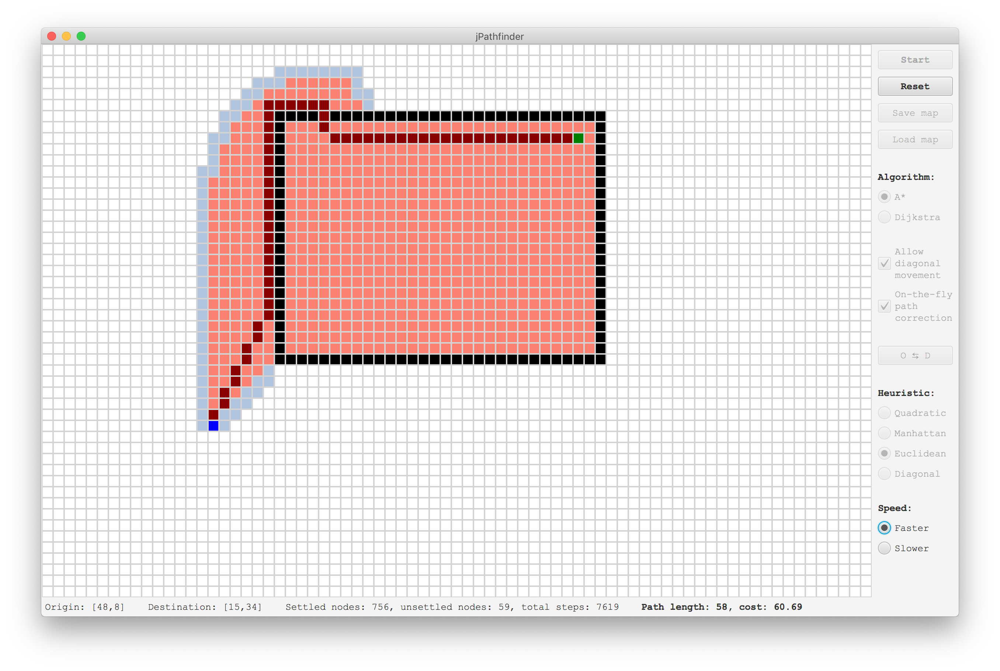

# jPathfinder

A quick app that visualises Dijkstra and A* pathfinding algorithms. Written in Java using JavaFX and my own [SquareGrid](https://github.com/SpinningVinyl/SquareGrid) class.

## Usage

The user interface is pretty self-explanatory, but here is a short explanation anyway.

**Algorithm**: A* (A-star) or Dijkstra. Dijkstra's algorithm doesn't have a heuristic component and usually takes longer to find the destination than A* (it has other advantages but they're mostly irrelevant here).

**Allow diagonal movement**: if turned off, the algorithm will move only to adjacent cells (up, down, left or right).

**The O ⇆ D button** quickly swaps the origin and the destination.

**Heuristic**: this greatly affects the algorithm's behaviour. In general, the higher the weight of the heuristic in the full cost of any given node, the faster it finds the destination at the cost of optimality. 

If *dx* = horizontal distance between the current node and the destination and *dy* = vertical distance between the current node and the destination, then the heuristics are as following:

 - Quadratic: *dx2 + dy2*. This heuristic overestimates the cost of getting to the destination by a lot. It usually results in finding the path to the destination very quickly but in a very suboptimal way. (Since A* is a best-first algorithm, it is important that the H-cost underestimates the actual cost of getting to the destination.)
 - Manhattan: *dx + dy*. This is the most accurate heuristic when diagonal moves are disabled. Euclidean heuristic might produce better results.
 - Euclidean: *sqrt(dx2 + dy2)*. This is the most accurate heuristic when diagonal moves are enabled. Diagonal heuristic might produce better results.
 - Diagonal: *max(dx, dy)*. 

**Speed**: the faster setting is highly recommended for Dijkstra!

When the algorithm is running, the application shows current statistics (settled and unsettled nodes, and the total number of steps). Both opening the node (adding it to the collection of unsettled nodes) and settling the node count as one step.

If the path is found, the application will display its length and also approximate cost. The cost of a move to an adjacent node is 1, and the cost of a diagonal move is sqrt(2).

I have also included some sample maps that showcase the difference between the two algorithms, and also the effects that different settings have on the behaviour of the A* algorithm.

## Legend

Pink squares represent settled nodes, pale blue squares represent unsettled nodes, dark red squares represent the path (if it exists) and the fuchsia square is the current node.

### License

This project is shared under the terms of [CC BY-NC-SA 4.0](https://creativecommons.org/licenses/by-nc-sa/4.0/) license.
