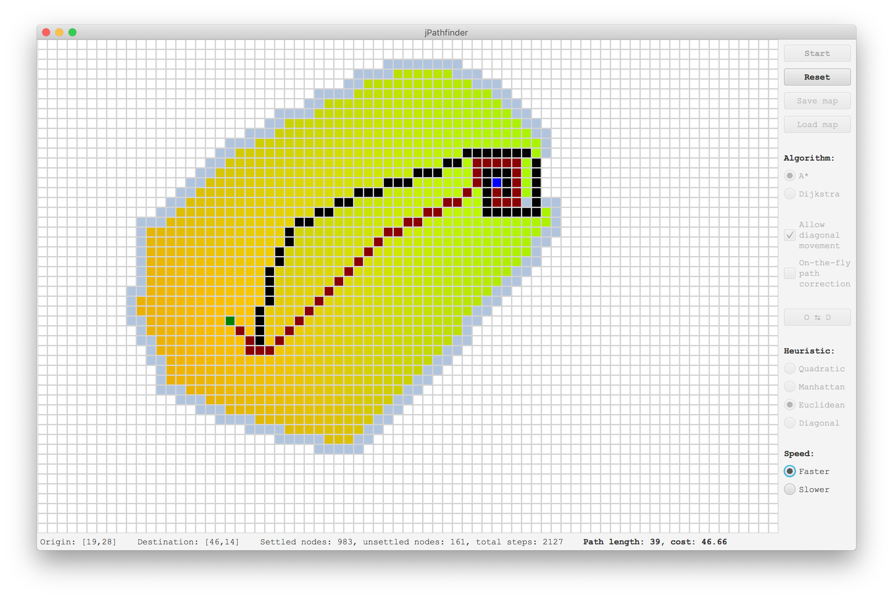

# jPathfinder

A quick app that visualises Dijkstra and A* pathfinding algorithms. Written in Java using JavaFX and my own [SquareGrid](https://github.com/SpinningVinyl/SquareGrid) class.

## Usage

The user interface is pretty self-explanatory, but here is a short explanation anyway.

*Algorithm*: select A* (A-star) or Dijkstra. Dijkstra's algorithm doesn't have a heuristic component and is much slower than A* (it has other advantages though).

*Allow diagonal movement*: if turned off, the algorithm will move only to adjacent cells (up, down, left or right).

*Heuristic*: this has a great effect on the algorithm's behaviour. In general, the higher the weight of the heuristic in the full cost of any given node, the faster it finds the destination, but the path may be suboptimal.

*Speed*: the faster setting highly recommended for Dijkstra!

The load and save functionality is a bit sketchy at the moment but it works most of the time.

## Legend

Pink squares represent settled nodes, pale blue squares represent unsettled nodes, red squares represent the path (if it exists) and the fuchsia square is the current node.

### License

This project is shared under the terms of [CC BY-NC-SA 4.0](https://creativecommons.org/licenses/by-nc-sa/4.0/) license.
